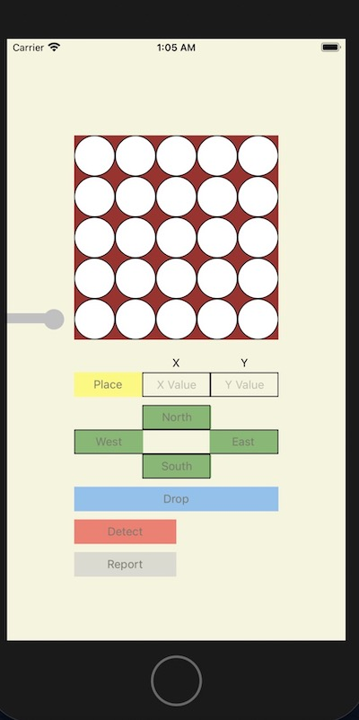
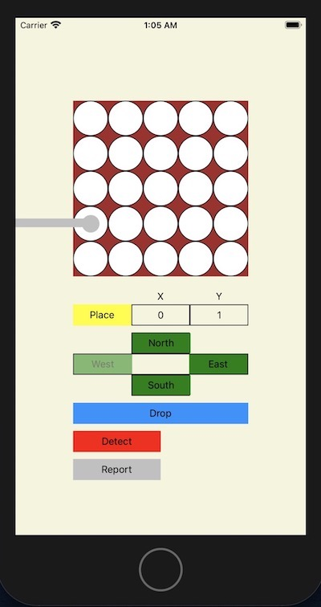
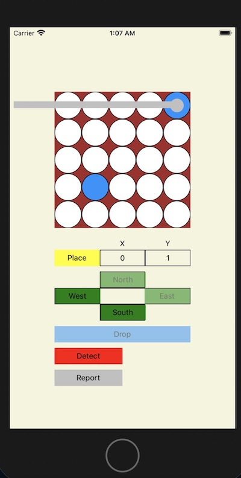
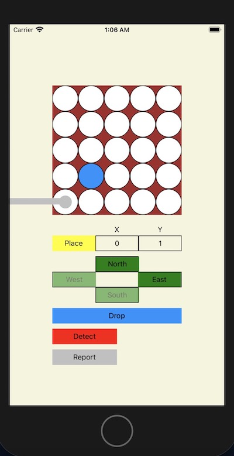
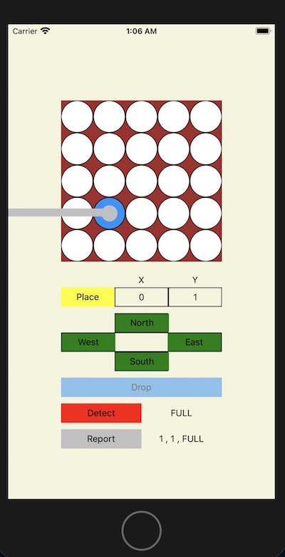

## Table of contents

-   [How It Works](#screenshots)

## How It Works

## Initial State

- The robot arm is not over the plate and all buttons are disabled.
- Need to enter valid x and y values for place button to become enabled.

## Place Command

- Once place command is executed all buttons become enabled.
- Move buttons become disabled if arm is on outer edges. In example place command is 0, 1 so the west button is disabled as the arm is not permitted to move outside the plate.

## Move Command North East Disabled

- Move commands are done by clicking on North, East, South, West buttons.
- In this case robot arm is in position 4,4 so North and East buttons are disabled.

## Move Command South West Disabled

- In this case robot arm is in position 0,0 so South and West buttons are disabled.

## Drop Disabled Detect Report

- When Drop is clicked the well becomes blue to indicate that it is full and the button becomes disabled, when robot arm moves to empty well is becomes enabled again.

- When Detect is clicked the status of well is displayed either EMPTY or FULL when arm is moved the detect display becomes blank again.

- When Report is clicked the position of robot arm is displayed and the status of the well is also displayed. In example robot arm is over 1,1 and well is full. when arm is moved the report display becomes blank again.

